[portfolio](https://barelogic.github.io) &nbsp;·&nbsp;
[github](https://github.com/barelogic) &nbsp;·&nbsp;
[linkedin](https://www.linkedin.com/in/venkatesh-rathinasabapathy-671491322/) &nbsp;·&nbsp;
[email](mailto:venkateshr.work@gmail.com)

> Full-stack developer based in India, working worldwide. 
> Small, sharp tools over big vague ideas.

I build scalable web apps with **React, Django & PostgreSQL**, blending clean 
engineering with bold, editorial interfaces. Right now that's 
[havensure](https://github.com/barelogic/havensure) — a full-stack app for a civil 
engineering x tech firm, with auth, forms, cart and secure payments. Also 
deep into realtime UIs, REST APIs and data visualisation.

<samp>python &nbsp; javascript &nbsp; react &nbsp; node &nbsp; express &nbsp; django &nbsp; postgres &nbsp; mongodb &nbsp; docker &nbsp; git &nbsp; linux</samp>

**[havensure](https://github.com/barelogic/havensure)** &nbsp;·&nbsp; <samp>node, express, postgres</samp> 
Full-stack app for a civil engineering x tech firm. Auth, form data, 
shopping cart and secure payment integration, end to end.

**[url-shortener](https://github.com/barelogic/Basic-URL-shortener)** &nbsp;·&nbsp; <samp>python, flask</samp> 
URL shortening service on Flask + SQLite. Runs on the local network, 
handles concurrent shorten requests with a clean REST API.

**[linkedin-clone](https://github.com/barelogic/LinkedIn_Clone)** &nbsp;·&nbsp; <samp>react, django, websocket</samp> 
LinkedIn-like app with Django backend and real-time messaging. 
Auth, profiles, job postings and Socket.io chat, built with one collaborator.

**[analytics-dashboard](https://github.com/barelogic/analytics-dashboard)** &nbsp;·&nbsp; <samp>react, django, d3</samp> 
Data visualisation dashboard with React and Django. Real-time analytics, 
interactive charts and PostgreSQL aggregations.

Every graphic here is generated, not embedded from anyone else's server. 
`ascii.svg` is a photo pushed through a character ramp by 
[`scripts/make_portrait.py`](scripts/make_portrait.py); the stat graphics and 
these section headings are drawn by [a scheduled action](.github/workflows/stats.yml) 
(`scripts/generate_stats.py`) straight from the GitHub GraphQL API, once a day, 
committing only what changed.

They animate with SMIL inside the SVG, because GitHub strips scripts from 
READMEs — and since nothing loads from a third party, nothing here can 
rate-limit or go dark. The headings are SVGs for the same reason: GitHub also 
strips CSS, so an image is the only way to put this page's own typeface on them.

The typeface is [JetBrains Mono](scripts/fonts), subset to just the characters 
each graphic draws and inlined as base64. That isn't only for looks: the 
portrait's grid assumes an advance width of exactly 0.600 em, and a viewer whose 
default monospace is narrower would otherwise see it squeezed.

Language totals cover public repositories only. `year.svg` uses the portrait's 
character ramp: `:` `+` `#` `@`, quiet to loud.
